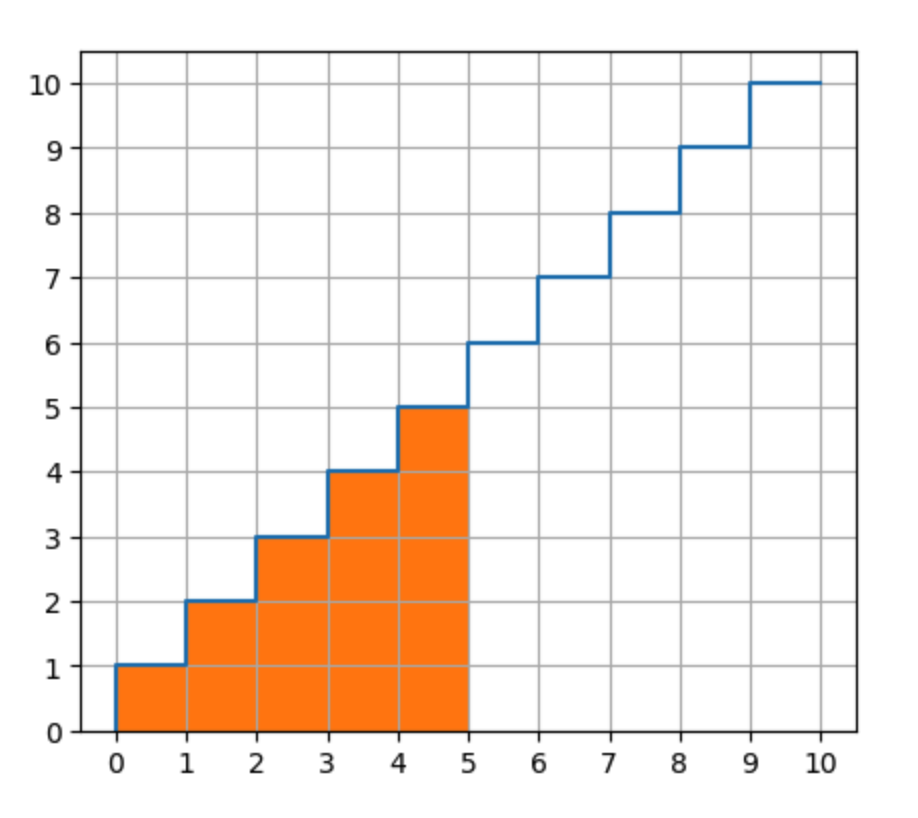

# Linear bonding curve

## Why can the area under a bonding curve be used to price a trade?

Using the area under the curve to price a trade is a short-cut.  In order to understand why, let's look at how to manually calculate the price.

The manual way to calculate the price is to add up the individual prices for each x-axis increment.  In this case, the x-axis increment is one token.

If the supply is 0, and you want to purchase 5 tokens, the price should be: 1+2+3+4+5=15.  If the supply is already 5 and you want to purchase 5 tokens, the price should be: 6+7+8+9+10=40.  To calculate this sum in a contract requires a for-loop and `n` iterations, where `n` is the number of tokens purchased.

That summation is an arithmetic series, and there is a short-cut to calculate its sum, as you have pointed out:

```
n(n+1)/2
```  

That formula is essentially calculating the area underneath this discrete step-wise curve.  The area underneath a step-wise curve is equivalent to the summation of the area of each step.  Since the width of each step is just 1 unit, the magnitude of the step height matches the magnitude of step area (which makes it easy to confuse which value is being talked about).

The following graph shows the price function and that the price of purchasing 5 tokens is the same as the area underneath the step-wise curve up to that point.  There are 15 orange boxes, corresponding to the price of 15.

 .

The reason we use area, instead of just the y-value, is because the units of the y-axis are `price per token` (e.g. ether per token) and the units of the x-axis are `tokens`.  To get price by itself, we have to multiply the `price per token` by `tokens`, so that the token unit cancels out.  In this case, the amount of tokens for each step is 1, so the multiplication seems trivial.

The area under the graph is referred to as the `reserve`, because that is how many tokens have been invested into the contract up to that point, and hence the total value that the contract is holding in reserve.

In order to calculate the purchase price for tokens purchased when the contract already has some reserve, as opposed to starting with a supply of zero, you need to compute the area representing just the new token purchase.  A quick way to compute this, as you have noted, is to compute:

```
price = reserve_after_purchase - reserve_before_purchase
```

That difference represents the price you should pay for those tokens, so that the reserve ends up at the correct after-purchase level.

We could leave this problem right here, but there is another simplification that we can make, and that simplification is the source of confusion prompting this question.

The simplification is to use a continuous function, f(x) = x, rather than the step-wise function.

The article you linked gives us some intuition for what happens when we shrink the size of the x-axis units, from 1 to 0.1 to 0.01 to infinitesimally small.  If, instead of purchasing 1 token unit with a single price, you purchase 10x 10th's or 100x 100th's of a token, where each fraction has its own price according to the curve.  As the fraction gets smaller, the total price also gets smaller, to a convergence point.  

The smallest price you would pay occurs when you are purchasing an infinite amount of infinitesimally small units.  This is what it means to have a bonding curve that is a smooth continuous function of x, instead of a discrete step-wise function.  Because you can no longer sum all all the discrete steps, but have to use calculus to integrate the function in order to compute the summation (area).  The integral of the function f(x) = x is:

```
integral(f(x)) = x^2 / 2
```

Notice that this looks very close to the step-wise area function above, which has just be shifted by +1.  

The very curious result is that if you purchase 1 token, the price should be 0.5 ETH.

If your pricing function y-axis units were `1 WEI per token`, instead of `1 ETH per token`, the price to purchase 1 token would be 0.5 WEI.  Since it is not possible to send fractions of WEI, your algorithm would need to either consistently round-up or round-down.

In conclusion, in this case it does not matter very much whether you use a step-wise or continuous pricing function, because the results are close enough between them.  It is just important to understand the tradeoffs of each.

For more complicated price curves, using the continuous version probably simplifies the calculations considerably, and there will likely be cases without any step-wise area functions.