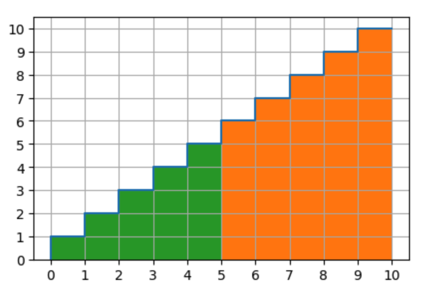

# Linear bonding curve

Given a market that sells a token, where the price of each token is determined by a bonding curve, how do you determine the price for purchasing batches of tokens? As a simple example, the price of each token is equal to the respective supply which includes the purchased token. The price formula is as follows:

```
price of token = f(x)
supply = x
f(x) = x
```

The price of a given batch purchase is equal to the area under the bonding curve that lies between the total supply before the purchase and the total supply after the purchase.

For a discrete bonding curve, the area function is:

```
x * (x+1) / 2
```

For a continuous bonding curve, the area function is:

```
x^2 / 2
```

## Why can the area under a bonding curve be used to price a trade?

Using the area under the curve to price a trade is a short-cut. In order to understand why, let's look at how to manually calculate the price.

The manual way to calculate the price is to add up the individual prices for each x-axis increment. In this case, the x-axis increment is one token.

If the supply is 0, and you want to purchase 5 tokens, the price should be: 1+2+3+4+5=15. If the supply is already 5 and you want to purchase 5 tokens, the price should be: 6+7+8+9+10=40.

To calculate this sum in a smart contract requires a for-loop and `n` iterations, where `n` is the number of tokens purchased.

That summation is also an arithmetic series, and there is a short-cut to calculate its sum:

```
sum of an arithmetic series = x * (x+1) / 2
```

That formula is essentially calculating the area underneath this discrete step-wise curve. The area underneath a step-wise curve is equivalent to the summation of the area of each step. Since the width of each step is just 1 unit, the magnitude of the step height matches the magnitude of step area (which makes it easy to confuse which value is being talked about: area or y-value).

The following graph shows the price function and that the price of purchasing 5 tokens is the same as the area underneath the step-wise curve up to that point. There are 15 orange boxes, corresponding to the price of 15.


The reason we use area, instead of just the y-value, is because the units of the y-axis are `price per token` (e.g. ether per token) and the units of the x-axis are `tokens`. To get price by itself, we have to multiply the `price per token` by `tokens`, so that the token units cancel out. In this case, the amount of tokens for each step is 1, so the multiplication seems trivial.

The area under the graph is referred to as the `reserve`, because that is how many tokens have been paid into the contract up to that point, and hence the total value that the contract is holding in reserve.

In order to calculate the purchase price for tokens purchased when the contract already has some reserve, as opposed to starting with a supply of zero, you need to compute the area representing just the new token purchase. A quick way to compute this is:

```
price = reserve_after_purchase - reserve_before_purchase
```

That difference represents the price you should pay for those tokens, so that the reserve ends up at the correct level after the purchase.

You can see this graphically in the following:



With 5 tokens already sold (in green, reserve = 15), to purchase another 5 tokens will cost 40 (in orange there are 40 boxes).

This is the same as saying the purchase price is the final supply (55) less the initial supply (15), which makes 40.

```
price = reserve_after_purchase - reserve_before_purchase
-> 55 - 15 = 40
```

Using the area function produces the same result:

```
area function = reserve = x * (x+1) / 2

initial supply = 5
initial reserve = 5*(5+1)/2 = 30/2 = 15

final supply = 10
final reserve = 10*(10+1)/2 = 110/2 = 55

price = final reserve - initial reserve
price = 55 - 15 = 40
```

We could leave this problem right there, but there is another simplification that can be made.

The simplification is to start reducing the size of the increments that can be purchased, from 1 token to 0.1, to 0.001, and so on, until the increment is infinitesimally small. [This article](https://medium.com/aventus/token-bonding-curves-683b8b309c18) gives us some intuition for what happens when we shrink the size of the x-axis units: the total price also goes down.

The smallest price you could pay occurs when you are purchasing an "infinite" amount of infinitesimally small units. This is what it means to have a bonding curve that is a continuous (smooth) function of x, instead of a discrete step-wise function. A continuous function looks like the red line overlaid on the previous plot:


You can see that the line closely approximates the step-wise function, but it cuts off half of the top squares.

To get the purchase price for a quantity of tokens purchase, you can no longer manually sum up the increments. Because you can no longer sum all of the discrete steps, but have to use calculus to integrate the function in order to compute the summation (area). The integral of the function f(x) = x is:

```
integral(f(x)) = x^2 / 2
```

Notice that this looks very close to the step-wise area function above, which has just been shifted by + 1.

The very curious result is that if you purchase 1 token (and your price units are ETH), the price should be 0.5 ETH. This is the correct result, because you've not purchased one full token for a price of 1, as in the step-wise case, but a lot of tiny token pieces for a lot of prices much smaller than 1. The summation of all of these prices is 0.5.

If your pricing function y-axis units were `1 WEI per token increment`, instead of `1 ETH per token increment`, the price to purchase 1 token would be 0.5 WEI. Since it is not possible to send fractions of WEI, your algorithm would need to either consistently round-up or round-down. Generally you want to round in the direction that favors the contract, so that you don't get in a situation where rounding error results in the contract not being able to pay out the full amount.

In conclusion, it matters little whether you use a step-wise or continuous pricing function, because the results are close enough between them. It is just important to understand the tradeoffs of each. If you want to be able to sell small partitions of one token and minimize the math operations, then use a continuous curve. If you want to avoid strange results like 1 token costing 0.5, then go with a discrete step-wise curve.

For more complicated price curves, using the continuous version probably simplifies the calculations considerably, and there may likely be cases that don't have simple step-wise area functions.
